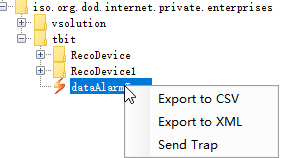
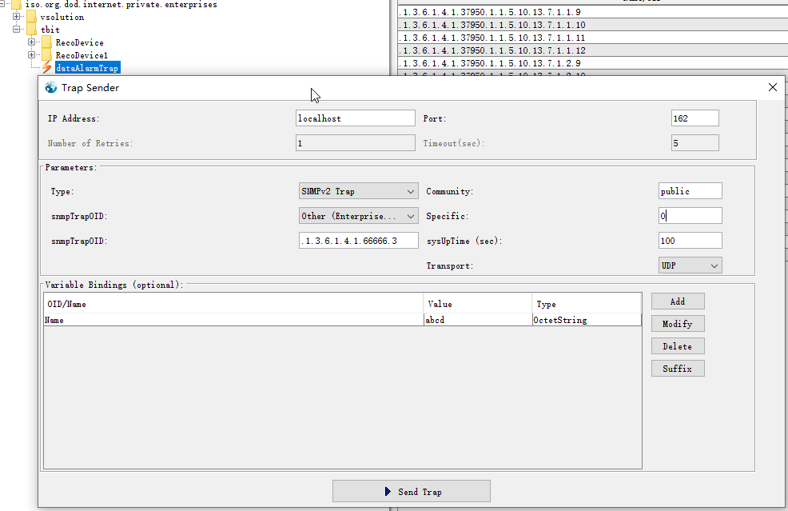

今天在园区走了走，然后突然想明白了几天来思考的snmp trap的逻辑。结合若干工具

1. node包node-net-snmp
2. mib browser 
3. 一个我写的mib文件，其中有一个oid，和一个trap oid，指向对象为第一个oid

把这个过程run成功。快速记录下。

# 先准备好接收snmp trap的应用

下载node-net-snmp 的源代码库，然后：

        cd example    
        node snmp-receiver.js -v

其中-v表示输出要罗嗦一点，这样我们才看得到具体的trap内容。

# 通过mib browser记载mib文件，并发送trap到本机的trap接收器

# output 
        
        2020-4-9 17:46:09: TrapV2 received:
        {
          "pdu": {
            "type": 167,
            "id": 402812005,
            "varbinds": [
              {
                "oid": "1.3.6.1.2.1.1.3.0",
                "type": 67,
                "value": 0
              },
              {
                "oid": "1.3.6.1.6.3.1.1.4.1.0",
                "type": 6,
                "value": "1.3.6.1.4.1.66666.3"
              },
              {
                "oid": "1.3.6.1.4.1.66666.1.1.0",
                "type": 4,
                "value": {
                  "type": "Buffer",
                  "data": [
                    97,
                    98,
                    99,
                    100
                  ]
                }
              }
            ],
            "scoped": false
          },
          "rinfo": {
            "address": "127.0.0.1",
            "family": "IPv4",
            "port": 63984,
            "size": 90
          }
        }
        
# 解释

varbinds共三个，其中
1. oid "1.3.6.1.2.1.1.3."表示sysuptime,每个trap都会发的varbind
2. oid “1.3.6.1.6.3.1.1.4.1”表示trap本身的oid指向。mib文件内定义的dataAlarmTrap.objects内的名称指向的就是此名称都用的oid。
3. oid "1.3.6.1.4.1.66666.1.1"就是trap的oid本身的新的值。value中每个"data": [97，98，99，100 ]是数字的asccii表达，可以toString()获取它的字符串

# 附录：MIB文件内容

    tbit DEFINITIONS ::= BEGIN
        IMPORTS
            enterprises, IpAddress, Integer32, Unsigned32, Counter64, 
            OBJECT-TYPE,NOTIFICATION-TYPE
                FROM SNMPv2-SMI;
        tbit OBJECT IDENTIFIER ::= { enterprises 66666 }
        RecoDevice OBJECT IDENTIFIER ::= { tbit 1 }
        RecoDevice1 OBJECT IDENTIFIER ::= { tbit 2 }
        Name OBJECT-TYPE
            SYNTAX OCTET STRING
            MAX-ACCESS read-write
            STATUS current
            DESCRIPTION
                "Description."
            ::= { RecoDevice 1 }
    	dataAlarmTrap NOTIFICATION-TYPE
    			OBJECTS { Name }
    			STATUS current
    			DESCRIPTION 
    				"Description."
    			::= { tbit 3 }
    END
    
    			
